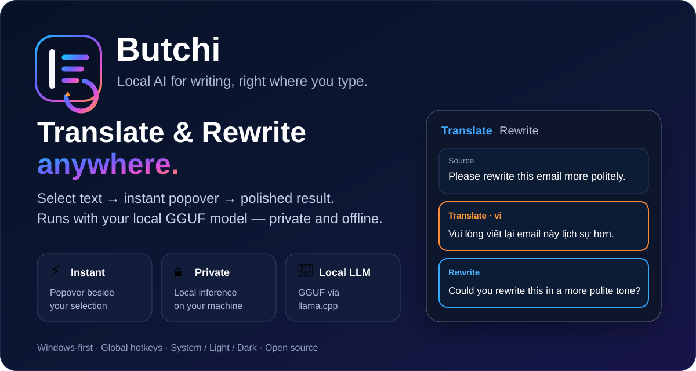

<p align="center">
  
</p>

<h1 align="center">Butchi</h1>

<p align="center">
  <em>bút chì</em> — private local Translate & Rewrite for Windows
</p>

<p align="center">
  
</p>

<p align="center">
  <a href="https://github.com/dhhieu113pro/butchi/actions/workflows/ci.yml"></a>
</p>

<p align="center">
  <a href="https://dhhieu113pro.github.io/butchi/">Product page</a> ·
  <a href="https://github.com/dhhieu113pro/butchi/releases/latest">Latest release</a>
</p>

## What Butchi does

Butchi is a Windows tray utility that captures selected text and opens a small cursor-adjacent popover for **Translate** and **Rewrite**. Generation runs through a local GGUF model via llama.cpp.

### Highlights

- Automatic popover for supported mouse selections.
- **Double-Ctrl** for keyboard-selected text.
- Windows UI Automation capture with guarded clipboard fallback.
- Local GGUF inference via `llama-cpp-2`.
- Streaming Translate / Rewrite output.
- Optional **Copy result**, **Replace selected text**, or no automatic action.
- Editable Translate and Rewrite system prompts.
- Prompt profiles: Natural, Literal, Professional, Grammar only, Shorter, More polite, Simple language, and Custom.
- Favorite target languages with one-click rerun.
- Searchable local history with configurable retention.
- Auto / CPU / GPU inference preference with CPU fallback when supported by the build.
- System / Light / Dark appearance.
- First-run model setup and local-data deletion controls.

## Privacy

Selected text, prompts, generated results, and history are processed/stored locally and are not sent to a cloud AI service. Network access is used when the user explicitly downloads a GGUF model from Hugging Face.

See [PRIVACY.md](PRIVACY.md).

## Development

Requirements: Rust, Node.js, CMake, a C/C++ toolchain, and LLVM/libclang.

```sh
npm install
npm run dev
```

The local LLM feature is enabled by default.

### GPU builds

```sh
# NVIDIA CUDA
npm run tauri build -- --features cuda

# Vulkan
npm run tauri build -- --features vulkan
```

The default public build can still be CPU-only; Auto mode only uses GPU backends that were compiled into that binary.

## CI

GitHub Actions runs on every push/PR to `main` for:

- Windows x64 (`windows-latest`)
- Windows ARM64 (`windows-11-arm`)

CI runs frontend type/build checks and Rust `cargo check`, `cargo test --all-targets`, and Clippy with the local LLM enabled.

A separate Windows screenshot workflow launches the real Tauri UI in an isolated deterministic capture mode and produces the canonical light/dark popover and Settings screenshots used by the product page.

## Model setup

On first launch, Settings opens automatically if no GGUF model is installed.

1. Choose a model.
2. Click **Download** (default Qwen3.5 0.8B Q4_K_M is about 530 MB).
3. Click **Load model**.
4. Select text and use Butchi.

Models are stored in Butchi's OS application-data directory.

## Windows releases

The GitHub release workflow builds x64 and ARM64 Windows packages from `v*` tags.

## Microsoft Store

Store packaging and submission automation lives in `.github/workflows/publish-windows-store.yml`. See the workflow and Store documentation in this repository for the current package format, credentials, and release requirements.

## Screenshots

The public product page uses real PNG captures generated from the actual Windows Tauri UI by `.github/workflows/screenshots.yml`:

- `docs/shots/popover-light.png`
- `docs/shots/popover-dark.png`
- `docs/shots/settings-light.png`
- `docs/shots/settings-dark.png`

The older SVGs under `docs/assets/` are design illustrations and remain only as repository/reference artwork.

## License

[MIT](LICENSE)
