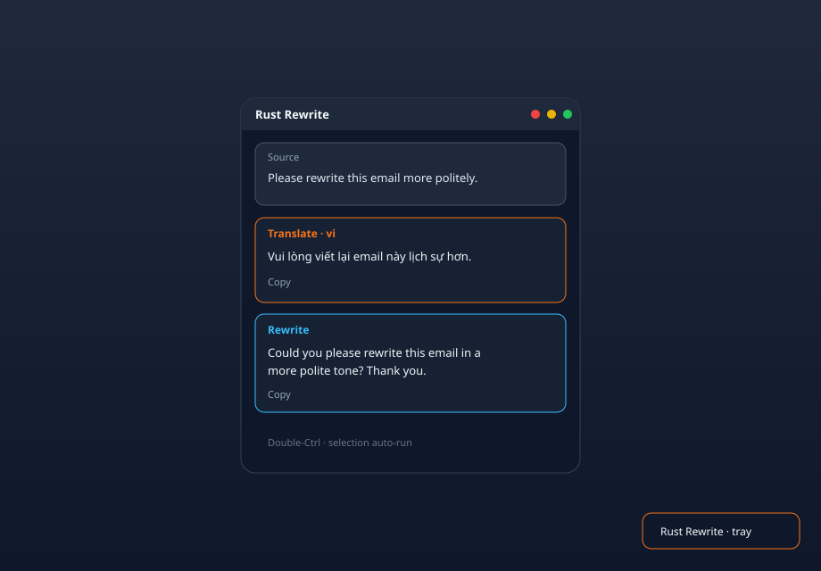
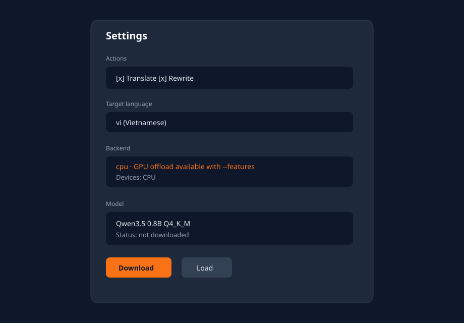

<p align="center">
  
</p>

<h1 align="center">Butchi</h1>

<p align="center">
  <em>bút chì</em> — Windows-first Tauri tray utility for Translate & Rewrite with a local LLM
</p>

<p align="center">
  
</p>

<p align="center">
  <a href="https://github.com/dhhieu113pro/butchi/actions/workflows/ci.yml"></a>
</p>

## Screenshot

<p align="center">
  
</p>

<p align="center"><em>Cursor-adjacent popover — source block + Pot-style Translate / Rewrite cards</em></p>

<p align="center">
  
</p>

<p align="center"><em>Settings — actions, language, backend, model download</em></p>

## Features

- Tray-only background app (no centered main window)
- Automatic popover after mouse-drag or double-click text selection
- Double-Ctrl tap for keyboard selections
- Windows UI Automation capture (no clipboard mutation) with guarded clipboard fallback
- **Translate** and **Rewrite** actions (auto-run on open when enabled)
- **Settings** window (tray → Settings):
  - Enable / disable Translate and Rewrite
  - Target language for translation
  - Editable rewrite system prompt
  - Local LLM model picker + Hugging Face download
  - Backend indicator (`cpu` | `cuda` | `vulkan`) + detected devices
- Local GGUF inference via `llama-cpp-2` (default **Qwen3.5 0.8B** Q4_K_M)
- Optional GPU offload with Cargo features `cuda` or `vulkan`

## Development

Requirements: Rust, Node, CMake, and a C/C++ toolchain (needed by `llama-cpp-2` when the `llm` feature is on).

```sh
npm install
npm run tauri dev
```

### GPU builds

```sh
# NVIDIA CUDA (CUDA Toolkit required)
npm run tauri dev -- -- --features cuda

# Vulkan (Vulkan SDK required on Windows)
npm run tauri dev -- -- --features vulkan
```

After the tray icon appears:

1. Open **Settings** from the tray menu
2. Download the default **Qwen3.5 0.8B** model
3. Click **Load model**
4. Select text in a browser/editor — use Translate / Rewrite

## CI

GitHub Actions runs on every push/PR to `main`:

| Job | Platforms |
|-----|-----------|
| `test` | **windows-latest**, ubuntu-latest, macos-latest (Windows first) |
| Steps | `tsc --noEmit`, `cargo check --no-default-features`, `cargo test` |
| `feature-gate` | Linux — best-effort `--features llm` |

CI skips the `llm` feature (no `llama-cpp-sys-2` compile on runners). Local/dev builds include LLM by default.

## Build

```sh
npm run tauri build
# or with GPU:
npm run tauri build -- -- --features cuda
```

Models are stored under the OS app data directory (`…/butchi/models`).

## Microsoft Store (Windows x64 + ARM64)

Partner Center product type: **EXE or MSI app** (Tauri produces NSIS offline installers).
Reserve the Store product name as **Butchi**.

### One-time setup

1. Reserve the app name in [Partner Center](https://partner.microsoft.com/dashboard).
2. Edit `src-tauri/tauri.store.conf.json` and set `bundle.publisher` to your **Publisher display name** from Partner Center (must differ from the app product name).
3. Optional: add GitHub secrets `WINDOWS_CERTIFICATE` (base64 PFX) and `WINDOWS_CERTIFICATE_PASSWORD` if you want signed installers for direct download. Microsoft Store offline-installer distribution does not require you to pre-sign for Store acceptance the same way MSIX does.

### Build installers (GitHub Actions)

Workflow: [`.github/workflows/publish-windows-store.yml`](.github/workflows/publish-windows-store.yml)

| Trigger | Result |
|--------|--------|
| Push tag `v0.1.0` (or any `v*`) | Build x64 + ARM64 NSIS setup.exe, attach to GitHub Release |
| Actions → **Publish Windows Store** → Run workflow | Same, draft release unless you use a tag |

Artifacts:

- `butchi-windows-x64` — NSIS `*-setup.exe`
- `butchi-windows-arm64` — NSIS `*-setup.exe` (runner: `windows-11-arm`)

Store config is merged at build time:

```sh
# local equivalent
npm run tauri build -- --bundles nsis --config src-tauri/tauri.store.conf.json
```

### Partner Center upload

1. Create product → **EXE or MSI app**.
2. Packages → add **offline** installer for **x64** and **ARM64**.
3. Installer parameters: `/S` (NSIS silent).
4. Complete Store listing, age ratings, and submit for certification.

WebView2 is configured as `offlineInstaller` in `tauri.store.conf.json` so the Store package does not rely on an online bootstrapper.

## License

See repository for license details.
